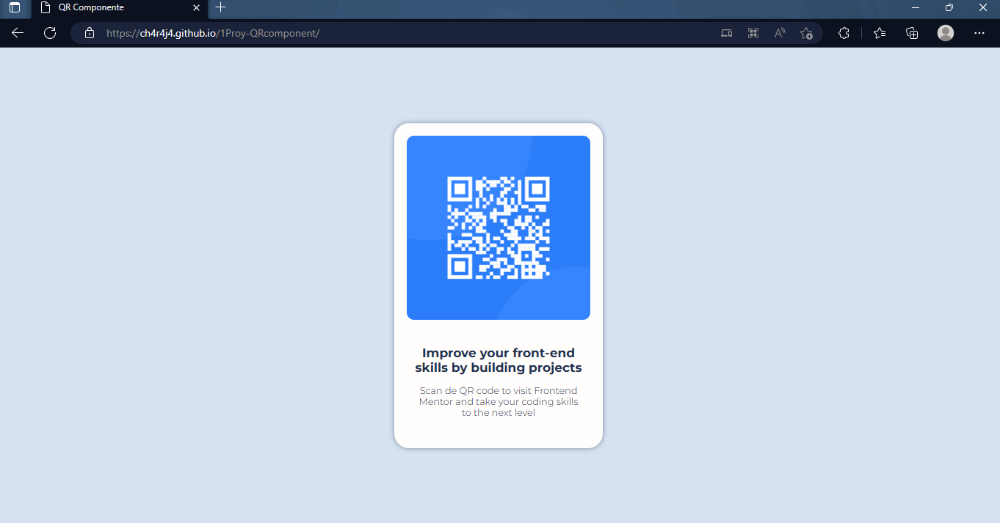

# Frontend Mentor - QR code component solution

This is a solution to the [QR code component challenge on Frontend Mentor](https://www.frontendmentor.io/challenges/qr-code-component-iux_sIO_H). 

## Table of contents

- [Overview](#overview)
  - [Screenshot](#screenshot)
  - [Links](#links)
- [My process](#my-process)
  - [Built with](#built-with)
  - [What I learned](#what-i-learned)
- [Author](#author)
- [Acknowledgments](#acknowledgments)

## Overview

### Screenshot



### Links

- Solution URL: [Add solution URL here](https://github.com/ch4r4j4/1Proy-QRcomponent)
- Live Site URL: [Add live site URL here](https://ch4r4j4.github.io/1Proy-QRcomponent)

## My process

### Built with

- Semantic HTML5 markup
- CSS custom properties
- Flexbox

### What I learned

```css
@import url('https://fonts.googleapis.com/css2?family=Montserrat:wght@300;700&display=swap');

body {
    background-color: hsl(212, 45%, 89%);
    padding: 0%;
    margin: 0%;
    height: 100vh;
    display: flex;
    justify-content: center;
    align-items: center;
}
```

## Author

- Github - [Paul Charaja](https://github.com/ch4r4j4)
- Frontend Mentor - [@ch4r4j4](https://www.frontendmentor.io/profile/ch4r4j4)